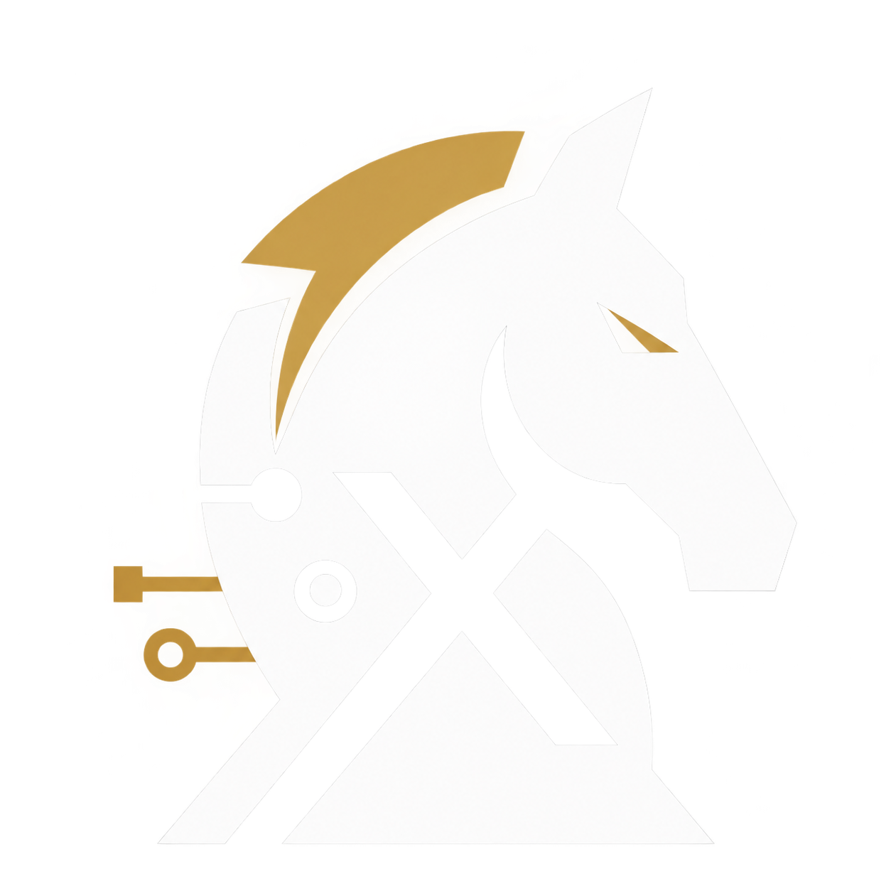

<pre>
 ██████   █████   ███    ███  ██████   ██  ██   ██
██       ██   ██  ████  ████  ██   ██  ██   ██ ██
██  ███  ███████  ██ ████ ██  ██████   ██    ███
██   ██  ██   ██  ██  ██  ██  ██   ██  ██   ██ ██
 ██████  ██   ██  ██      ██  ██████   ██  ██   ██

                G A M B I X . J S
</pre>

# Quick Start — Run Gambix and Connect a Logic Library

Gambix is a **UI-only library**: it renders the board and handles drag/click input, but it **does not know the rules of chess**.
That is why any real game is `Gambix (view)` + `logic library (rules)` such as `chess.js`, `chessops`, or any other.

This guide takes you from zero to a working game.

---

## 1. Install and first render

```bash
npm install
npm run build   # produces dist/bundle.js
```

```html
<div id="chess"></div>
<script type="module">
  import Gambix from "./dist/bundle.js";

  const board = new Gambix("#chess", {
    fen: "start", // or a full FEN string; default is the standard start position
    theme: { boardSize: 600, orientation: "white" },
    interaction: { control: "both", moveMechanic: "both" },
  });
</script>
```

- The first parameter is a **CSS selector** for an existing element. A missing element throws an `Error`.
- The second parameter is the config object (fully documented in `configuration.md`).

## 2. Connecting chess.js (the official pattern)

Only 3 steps:

1. `onPieceSelected` → ask the logic lib for legal moves and return them (the library renders the dots/rings automatically).
2. `onMoveRequested` → try the move in the logic lib; on success update the UI, on failure snap the piece back.
3. After every successful move → `loadFEN` + `setLastMove` + refresh check/mate visuals.

```js
import Gambix from "./dist/bundle.js";
import { Chess } from "https://esm.sh/chess.js@1.4.0";

const board = new Gambix("#chess", { fen: "start" });
const logic = new Chess();

// Show legal moves automatically
board.onPieceSelected(({ square, piece }) => {
  if (!piece) {
    board.clearLegalMoves();
    return;
  }
  const moves = logic.moves({ square, verbose: true }).map((m) => m.to);
  return moves; // <-- the library renders these by itself
});

// Validate and execute moves
board.onMoveRequested(({ from, to, promotion }) => {
  try {
    const mv = promotion
      ? logic.move({ from, to, promotion })
      : logic.move({ from, to });

    if (!mv) {
      board.rejectMoveFrom(from, to); // illegal move → snap the piece back
      return;
    }

    board.loadFEN(logic.fen());
    board.clearLegalMoves();
    board.setLastMove(from, to);
    refreshCheckState();
  } catch {
    board.rejectMoveFrom(from, to);
  }
});

function findKing(color) {
  for (const row of logic.board())
    for (const cell of row)
      if (cell && cell.type === "k" && cell.color === color) return cell.square;
  return null;
}

function refreshCheckState() {
  if (!logic.isCheck()) {
    board.clearCheck();
    board.clearCheckmate();
    return;
  }
  const loser = findKing(logic.turn());
  if (logic.isCheckmate()) {
    const winner = findKing(logic.turn() === "w" ? "b" : "w");
    board.clearCheck();
    board.setCheckmate(winner, loser);
  } else {
    board.clearCheckmate();
    board.setCheck(loser);
  }
}
```

> If `chess.js` is not available, the same pattern works with any logic library:
> just replace `logic.moves()`, `logic.move()`, and `logic.fen()` with the equivalents in your library.

## 3. Promotion

The library is UI-only: any pawn reaching the last rank opens the built-in
vertical promotion picker automatically. You decide the rules in
`onPromotionRequested` / `onMoveRequested` with your logic lib:

```js
// Optional: auto-pick or reject before the picker opens.
// Return "q"|"r"|"b"|"n" to skip the UI, false to reject + snapback,
// void to show the default picker.
board.onPromotionRequested(({ from, to }) => {
  const legal = logic
    .moves({ square: from, verbose: true })
    .some((m) => m.to === to && m.promotion);
  if (!legal) return false;
});

// The result arrives here after the user picks a piece
board.onPromotionSelected(({ from, to, promotion }) => {
  console.log("promotion:", from, to, promotion);
});

// Manual control if you ever need it (rare):
// board.choosePromotion(from, to, "q");
// board.cancelPromotion();
```

Note: when a move includes a `promotion`, `onMoveRequested` receives `{ from, to, promotion }` after the piece is picked — execute it in the logic lib as in the example above.

## 4. Common operations after wiring

```js
// New game
logic.reset();
board.loadFEN(logic.fen());
board.setLastMove(null, null);
board.clearCheck();
board.clearCheckmate();

// Undo
logic.undo();
board.loadFEN(logic.fen());

// Flip the board
board.flipBoard();

// Block a player from moving (e.g. spectator mode)
board.disableInteractionFor();
board.enableInteractionFor("both"); // restore control
```

## 5. Common mistakes

| Problem                                        | Cause and fix                                                                                    |
| ---------------------------------------------- | ------------------------------------------------------------------------------------------------ |
| Pieces do not move                             | `interaction.control` is probably `"none"` — use `board.enableInteractionFor("both")`            |
| Legal moves are not shown                      | `onPieceSelected` must **return an array** of squares, e.g. `["e4","e5"]`                        |
| An illegal move stays in place                 | You are responsible for calling `board.rejectMoveFrom(from, to)` when the logic lib rejects it   |
| The board does not update after `logic.move()` | You must call `board.loadFEN(logic.fen())` manually — the library does not observe the logic lib |
| The promotion UI never opens                   | The picker opens for any pawn 7→8 / 2→1 by shape — validate legality in `onPromotionRequested` (return `false`) and in `onMoveRequested` |

Next: [`configuration.md`](configuration.md) for every config key, and [`api-reference.md`](api-reference.md) for every method and event.
